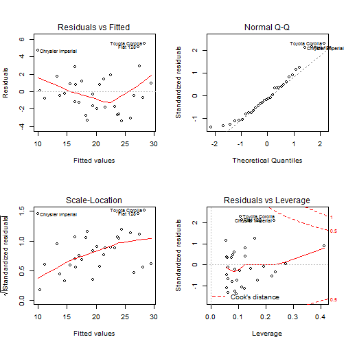

Predict Miles Per Gallon (MPG) of Cars
========================================================
author: Cheong Kok Hoe
date: 25 Apr 2015


Background & Basic Data Analysis
========================================================


The **mtcars** dataset in RStudio was extracted from the 1974 Motor Trend US magazine, and comprises fuel consumption and 10 aspects of automobile design and performance for 32 automobiles (1973-74 models).

The dataset contains 
- **32** observations. 
- **11** variables.

Building a Regression Model
========================================================

The sample of the observations in the **mtcars** dataset are

```
          mpg cyl disp  hp drat   wt  qsec vs     am gear carb
Mazda RX4  21   6  160 110  3.9 2.62 16.46  0 Manual    4    4
```

Using **am** (Transmission) as predictor, **wt** (Weight) and **hp** (horsepower) as confounders in the model.


```

Call:
lm(formula = mpg ~ am + wt + hp, data = mtcars)

Coefficients:
(Intercept)     amManual           wt           hp  
   34.00288      2.08371     -2.87858     -0.03748  
```

Diagnostics of Regression Model
========================================================

The residual plots of the bestmodel multivariable regression model

 

Using Model to Predict MPG of Cars
========================================================

For example, 
- **am** = "Automatic"
- **wt** = "3.5"
- **hp** = "120"

Predicted MPG = **19.4**


I want to try [Predict MPG of Cars!](https://kazakh1501.shinyapps.io/Project/)
